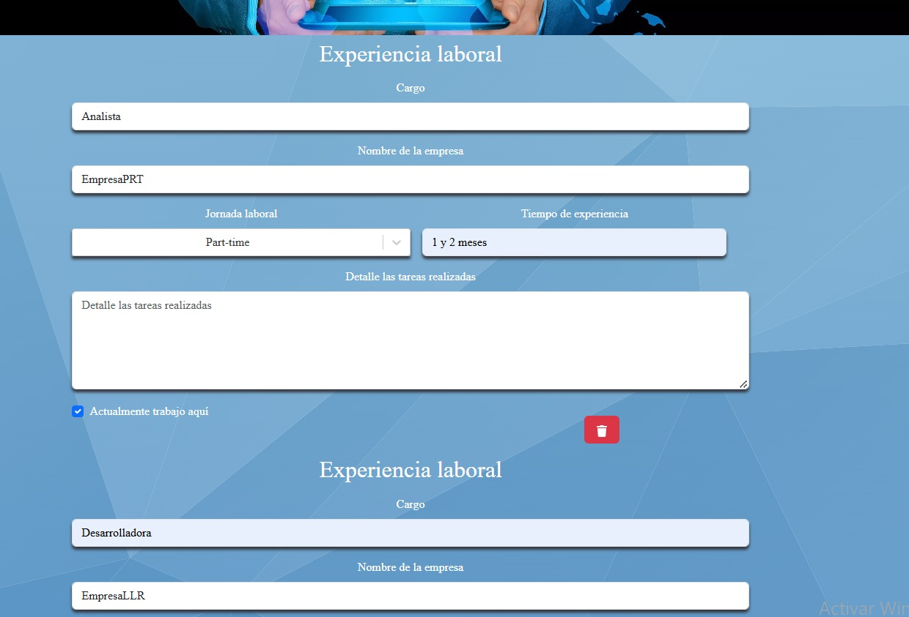
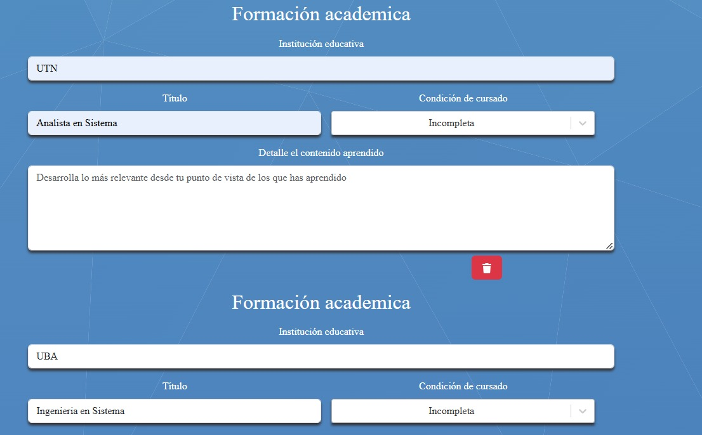
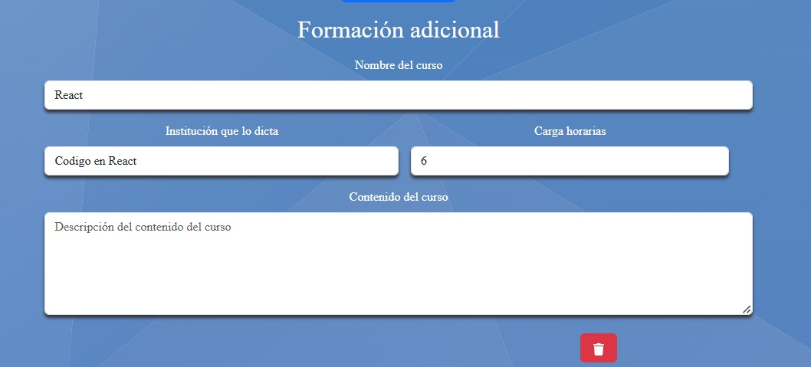
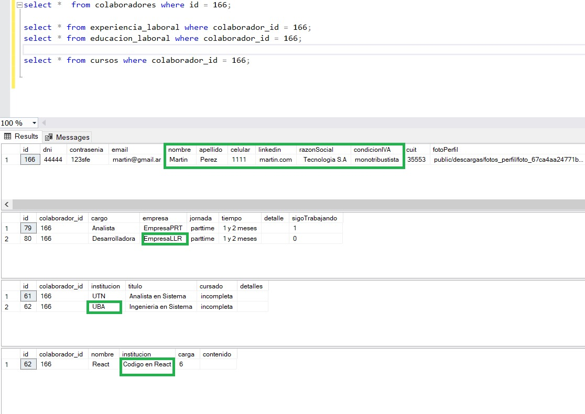
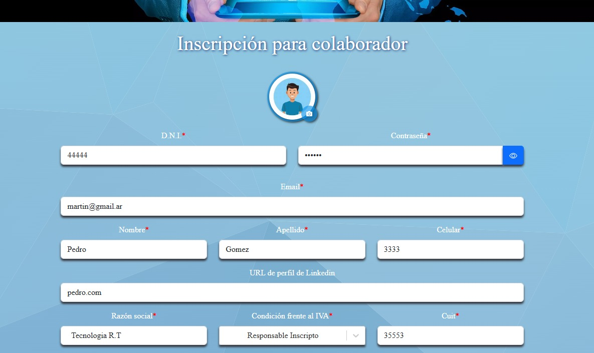
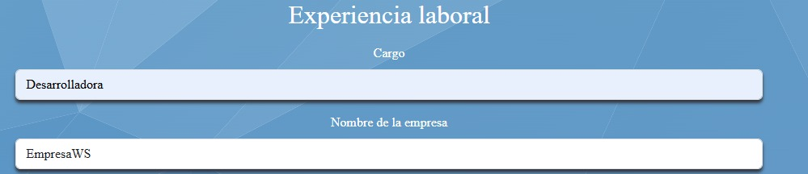
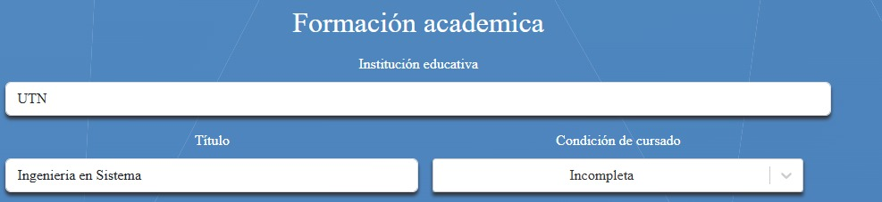
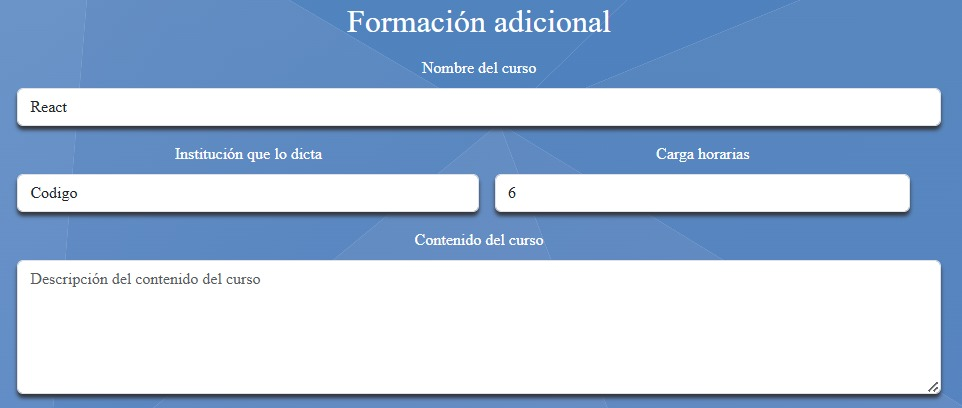
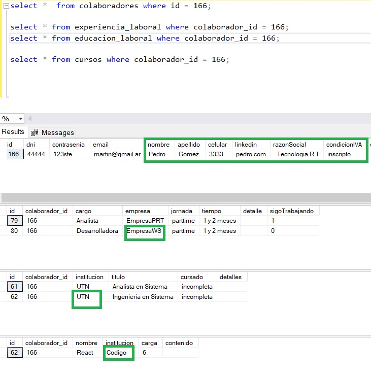

# 🚀 Proyecto: Gestión de Colaboradores

## 📌 Tecnologías utilizadas

PHP, CSS, SQL SERVER, TYPESCRIPT

🌍 Ubicación de Backend y Frontend

🔹 Frontend:
📂pasantes-main\colaboradores\src\pages\formColaborador\index.tsx

🔹 Backend:
📂pasantes-main\colaboradores\src\api\formColaborador.php

## 📌 Tablas en la Base de Datos

1️⃣ **Tabla colaboradores**
2️⃣ **Tabla experiencia_laboral**  
3️⃣ **Tabla educacion**
4️⃣ **Tabla cursos**

---

🌍 Funcionalidades

### ✅ Inserción de datos

- 📌Insertar un colaborador
  

- 📌 Insertar experiencia laboral
  

- 📌 Insertar educación
  

- 📌 Insertar curso
  

📌 **INSERT en Base de Datos**

---

## 🔄 Actualización de Datos

### 🖊️ Modificación de registros

- 📌 Actualizar datos del colaborador
  

- 📌 Actualizar experiencia laboral
  

- 📌 Actualizar educación
  

- 📌 Actualizar curso
  

📌 **UPDATE Base de datos**

