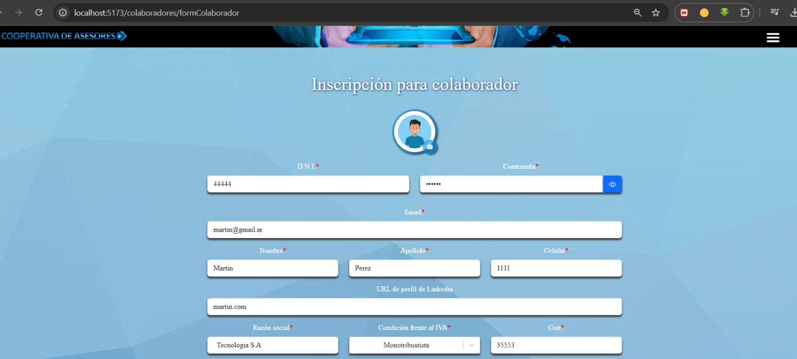

# 🚀 Proyecto: Gestión de Colaboradores

## 📌 Tecnologías utilizadas

PHP, CSS, SQL Server, TYPESCRIPT

## 📌 Tablas en la base de datos

1️⃣ **Tabla colaboradores**
2️⃣ **Tabla experiencia_laboral**  
3️⃣ **Tabla educacion**
4️⃣ **Tabla cursos**

---

🌍 Funcionalidades

### ✅ Inserción de datos

- 📌Insertar un colaborador
  

- 📌 Insertar experiencia laboral
  

- 📌 Insertar educación
  

- 📌 Insertar curso
  

📌 **INSERT en Base de Datos**

---

## 🔄 Actualización de Datos

### 🖊️ Modificación de registros

- 📌 Actualizar datos del colaborador
  

- 📌 Actualizar experiencia laboral
  

- 📌 Actualizar educación
  

- 📌 Actualizar curso
  

---

📌 **UPDATE Base de datos**

